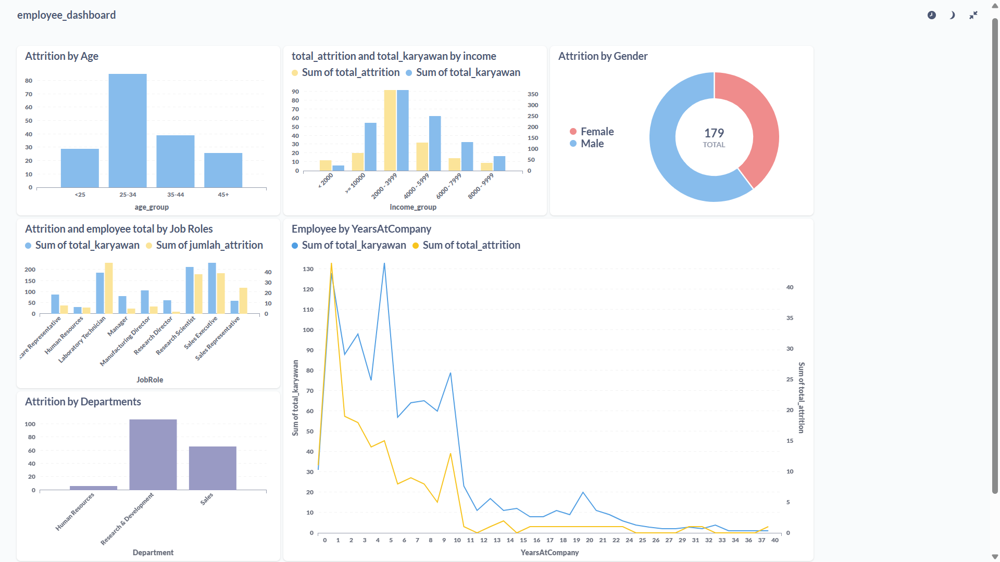

# Proyek Akhir: Menyelesaikan Permasalahan Perusahaan Edutech

## Business Understanding

Jaya Jaya Maju adalah perusahaan multinasional yang telah berdiri sejak tahun 2000 dan kini memiliki lebih dari 1.000 karyawan yang tersebar di berbagai wilayah. Seiring dengan pertumbuhan bisnisnya yang pesat, perusahaan menghadapi tantangan serius dalam hal manajemen sumber daya manusia, khususnya dalam mengelola retensi karyawan.

Walaupun telah menjadi menjadi perusahaan yang cukup besar, Jaya Jaya Maju masih cukup kesulitan dalam mengelola karyawan. Hal ini berimbas tingginya attrition rate (rasio jumlah karyawan yang keluar dengan total karyawan keseluruhan) hingga lebih dari 10%.

### Permasalahan Bisnis

- Tingginya attrition rate (di atas 10%) yang berdampak pada stabilitas organisasi.
- Tidak adanya alat visual (dashboard) untuk memantau metrik attrition secara dinamis.
- Tidak diketahui dengan pasti faktor-faktor yang paling berpengaruh terhadap keputusan karyawan untuk keluar, seperti usia, penghasilan, masa kerja, lembur, jabatan, dan kepuasan kerja.

### Cakupan Proyek

- **Pemahaman Data (Data Understanding)**

  - Mengimpor dataset karyawan yang diambil dari github.
  - Mengeksplor struktur data, tipe data, dan distribusi nilai dari setiap fitur pada dataset.
  - mengecek missing value pada kolom Attrition dan melakukan drop pada kolom tersebut.
  - Menghapus duplikasi
  - Push datasetyang sudah di bersihkan ke database postgres

- **Eksplorasi Data (Exploratory Data Analysis / EDA)**

  - Memeriksa outlier dengan boxplot.
  - Visualisasi bar chart distribusi Attrition.
  - Analisis hubungan antar fitur numerikal dengan korelasi Pearson.
  - Scatter plot antara TotalWorkingYears dan MonthlyIncome untuk memahami pola.

- **Persiapan Data (Data Preparation)**

  - Menghapus fitur yang tidak dibutuhkan
  - Melakukan encoding pada fitur kategorikal.
  - Melakukan pemisahan data untuk train dan test

- **Pemodelan Data (Modeling)**

  - Membangun beberapa model klasifikasi: K-Nearest Neighbors, Decision Tree dan Random Forest.

- **Evaluasi Model (Evaluation)**

  - Mengevaluasi performa masing-masing model menggunakan metrik akurasi, presisi, recall, dan F1-score.

  - Menyajikan confusion matrix untuk memahami distribusi prediksi model.

- **Pelaporan Hasil**

  - Membuat tabel untuk melihat performa model.
  - Mengidentifikasi model dengan performa terbaik berdasarkan metrik yang digunakan.

### Persiapan

Sumber data : [Employee Data Jaya Jaya Maju](https://github.com/dicodingacademy/dicoding_dataset/blob/main/employee/employee_data.csv)

Clone Repository
```
git clone https://github.com/Dilalovegood/Attrition-Prediction-Jaya-Jaya-Maju.git
cd Attrition-Prediction-Jaya-Jaya-Maju
```

Setup environment - Shell/ Terminal :

```
# Buat virtual environment
python -m venv venv

# Aktifkan virtual environment (Windows)
venv\Scripts\activate

# Install semua dependensi dari file requirements.txt
pip install -r requirements.txt
```

Run Prediction Python
```
Python dashboard.py
```

## Business Dashboard
```
username = postgres.crbobrshmijeejphcnlv
password = dilalovegood99
```

Dapat dilihat pada gambar dashboard di bawah

<p align="center">
  
</p>

- Total Karyawan: 1.058
- Attrition (berhenti): 179 karyawan (16,9%)
- Tidak Attrition (bertahan): 879 karyawan (83,1%)

Tingkat attrition cukup tinggi (mendekati 17%), yang bisa menjadi sinyal awal adanya isu retensi yang perlu ditindaklanjuti lebih lanjut.

- **Attrition Berdasarkan Usia**

  - Kelompok usia **25–34 tahun** adalah yang paling banyak mengalami attrition.
  - Sedangkan kelompok usia 45 ke atas plaing sedikit mengalami attrition.
  - Artinya, karyawan muda berpotensi tinggi untuk keluar dari perusahaan.

- **Attrition by Monthly Income**

  - Penghasilan bulanan di bawah 6000 lebih rentan terhadap attrition
  - Sebaliknya, kelompok pendapatan di atas 10000 memiliki attrition yang sangat rendah.

- **Attrition by Gender**

  - Tercatat laki-laki sekitar 60.34% yang melakukan attrition
  - Sedangkan perempuan sekitar 39.66%
  - Seehingga laki-laki lebih dominan keluar meskipun perbedaannya tidak terlalu signifikan.

- **Attrition by Job Role**

  - Laboratory Technician dan Sales Representative memiliki jumlah attrition tertinggi dibandingkan role lainnya.
  - Terdapat sekitar 49 dari 188 karyawan yang attrition dari job role Laboratory Technician
  - Terdapat sekitar 39 dari 232 karyawan yang attrition dari job role Sales Representative
  - Research Director memiliki total karyawan sedikit dan tingkat attrition rendah yaitu sekitar 2 dari 62 karyawan.

- **Attrition by YearsAtCompany**

  - Attrition sangat tinggi di tahun ke-1 hingga ke-4 masa kerja yaitu sekitar.
  - Setelah tahun ke-10, jumlah attrition hampir tidak ada — menandakan loyalitas jangka panjang.

- **Attrition by Department**
  - Mayoritas attrition berasal dari Research & Development sekitar 107 orang dan Sales sekitar 66 orang.
  - Departemen HR justru memiliki tingkat turnover paling kecil.

## Conclusion

- Proyek ini bertujuan untuk membangun model klasifikasi yang dapat memprediksi kemungkinan seorang karyawan akan keluar (attrition) dari perusahaan berdasarkan data historis karyawan Jaya Jaya Maju. Berdasarkan proses eksplorasi data, pembersihan, encoding fitur kategorikal, dan pelatihan model machine learning, dilakukan eksperimen menggunakan beberapa algoritma seperti K-Nearest Neighbors (KNN), Decision Tree dan Random Forest.

- Dari hasil evaluasi, **Random Forest** dipilih sebagai model akhir karena memberikan performa yang paling stabil dan generalisasi yang baik dengan akurasi mencapai 83%, precision 71%, recall 13%, F1-Score 0.22%. Model ini kemudian digunakan untuk melakukan prediksi terhadap karyawan dengan status `Attrition` yang belum diketahui.

- Fitur-fitur seperti **Usia**, **JobRole**, **MonthlyIncome**, **RelationshipSatisfaction**, dan **YearsAtCompany** memiliki kontribusi penting dalam mempengaruhi prediksi attrition.

### Rekomendasi Action Items (Optional)

Berdasarkan hasil analisis dan pemodelan prediktif terhadap attrition karyawan, berikut beberapa rekomendasi tindakan yang dapat dilakukan perusahaan :

- **Fokus pada masa kerja awal (0–4 tahun)**  
  Tingkat attrition tertinggi terjadi di awal masa kerja. Perusahaan perlu menyediakan onboarding yang efektif, serta pengawasan dan pembinaan intensif pada tahun-tahun awal.

- **Tingkatkan kepuasan kerja pada role dengan risiko tinggi**  
  Posisi seperti _Sales Representative_ dan _Laboratory Technician_ perlu perhatian khusus berupa peningkatan benefit non-finansial, jalur karier, atau pelatihan berkelanjutan.

- **Perbaiki skema kompensasi bagi karyawan berpenghasilan rendah**  
  Kelompok penghasilan di bawah 6000 lebih rentan keluar. Perlu ditinjau ulang sistem insentif dan kenaikan gaji, terutama bagi karyawan dengan performa baik.

- **Gunakan dashboard secara berkala sebagai alat monitoring HR**  
  Dashboard dapat dijadikan alat pemantauan rutin untuk melihat tren attrition dari waktu ke waktu, serta menjadi dasar pengambilan keputusan HR yang berbasis data.
